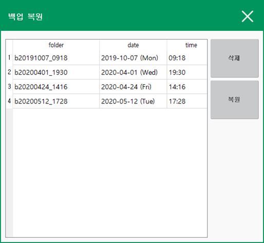

# 2.3 복원

‘\[**시스템**] – **2: 제어 파라미터** - **8: 자동 백업 및 복원**’ 화면으로 진입하십시오.

\[**복원**] 버튼을 클릭하면, 아래와 같은 화면이 나타납니다.

리스트박스에 복원 가능한 지점들이 백업한 시점을 기준으로 정렬되어 나타납니다. 가장 아래에 위치한 항목이 가장 최근의 백업 지점입니다.

* **삭제**: 항목을 선택한 후, \[**삭제**] 버튼을 누르면, 사용자의 확인을 받은 후 선택된 복원 지점을 삭제합니다.
* **복원**: **** 복원할 항목을 선택한 후, \[**복원**] 버튼을 누르면 복원이 시작됩니다.

복원이 완료되면 아래 그림과 같은 메시지가 나타납니다. 전원을 재투입하면 정상적인 사용이 가능해집니다.

.png>)
