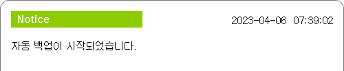
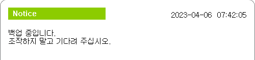
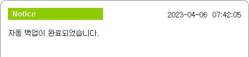

# 2.2 자동 백업의 실행

백업 조건이 만족하는 순간 백업이 실행됩니다. 설정 화면, 교시, 조그 진행 도중, 자동 모드의 로봇 재생 등 어떠한 상황에서도 백업은 수행됩니다. 단, 이미 백업이나 복원이 수행되고 있는 중에는 백업이 수행되지 않습니다.

백업 중엔 화면에 아래 그림과 같은 메시지박스가 나타납니다. 완료 메시지가 나올 때까지 조작을 멈추고 기다려주십시오.

백업되는 위치는 티치펜던트 혹은 메인 모듈 내의 아래 경로입니다.

<table>
	<tr>
		<td class='grayed'>
			
경로명 - TP

		</td>
		<td>
			
/usr/share/hyundai/hi6/backup/ts/

		</td>
		<td>
			
파일관리자 화면에서 TP 항목 밑의 backup/ts/

		</td>
	</tr>
	<tr>
		<td class='grayed'>
			
경로명 - MAIN

		</td>
		<td>
			
/ata0:2/lib/hi6/backup/ts/

		</td>
		<td>
			
파일관리자 화면에서 MAIN 항목 밑의 backup/ts/

		</td>
	</tr>
	<tr>
		<td class='grayed'>
			
생성되는 서브폴더명

		</td>
		<td>
			
b{날짜}_{시간}의 형식

		</td>
		<td>
			
접두어 b는 backup을 의미

		</td>
	</tr>
</table>

예) MAIN/backup/ts/b20230512_1730/

메인보드의 여유공간이 10% 미만일 경우에는, 가장 오래된 백업지점을 삭제한 후 백업이 수행됩니다. 만일, 백업 중 여유공간이 모자랄 경우에는 백업이 중단됩니다.

이력 창을 열면, 백업 시작과 종료, 에러의 기록을 볼수 있습니다.
